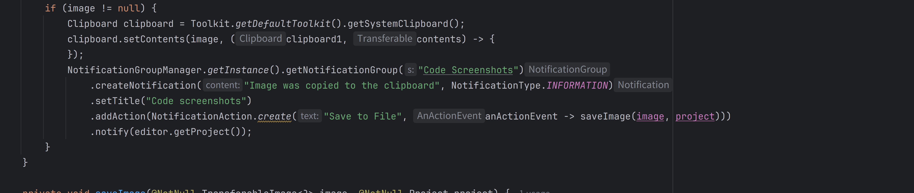
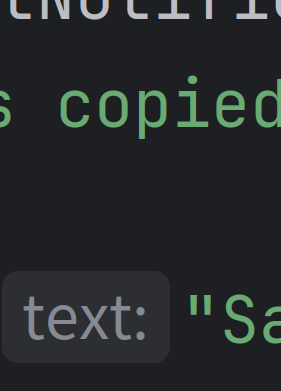

# code-screenshoter-jb-plugin

Simple IDEA plugin fork from [amaembo/screenshoter](https://github.com/amaembo/screenshoter).

It allows you to take sharp code screenshots.

Select code block and press `Ctrl+Alt+Shift+A` (`Option+Shift+Command+A`
on macOS).

Installation page on [Jetbrains marketplace](https://plugins.jetbrains.com/idea/plugin/26843-code-screenshoter).

## Example

##   And then we zoom in 

